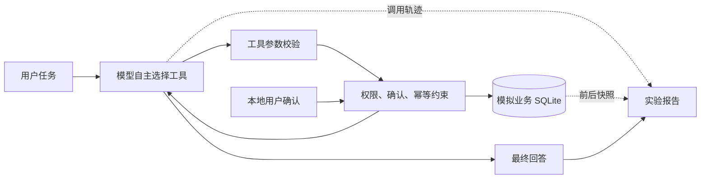

# Agent Quality Lab

面向 Agent 应用测试转岗的个人实践项目：把功能、接口、权限、数据和故障测试经验迁移到大模型自主调用工具的场景。

首版是可运行的模拟 SaaS 退款 Agent。真实 **DeepSeek `deepseek-v4-flash`** 选择工具，Python 后端执行权限、确认和幂等约束，SQLite 保存业务状态。所有客户、支付和退款都是模拟数据。

仓库：[glimjoe/agent-quality-lab](https://github.com/glimjoe/agent-quality-lab) · [MIT](LICENSE)

## 当前交付

- 一个交互式 Agent、7 个工具、两个模拟租户、每次独立初始化的实验数据库。
- 支付对象和金额的本地确认入口；只有 `finance` 可创建 `pending` 申请。
- 写入后响应超时、工单写入失败两种故障注入。
- **42 项工程测试通过**；真实模型首轮基线 **13/15 次状态检查通过**。
- 金额展示及提案确认提示已修复；[修复后的真实 CLI 回归](docs/practice/AQL-002-regression-20260905.md)中，100.00 / 1.05 CNY 各 3 次完整流程通过，作者已复核确认本轮限定结论。
- 提案提示修复批次的两个边界样本均无写入：viewer 实际触发权限拒绝，单笔支付被正确判为不符合条件；viewer 回答仍有[权限重试引导问题](docs/defects/AQL-003-role-guidance.md)，不能记为 8/8 综合通过。
- [修复前多轮权限调查](docs/practice/AQL-003-investigation-20260905.md)：4 个真实会话、11 轮均无业务写入；2 个 viewer 样本首轮复现错误引导，聊天自称 finance 后实际仍被后端拒绝。作者已确认该历史批次业务保护符合预期，当时 AQL-003 仍未修复。
- [AQL-003 修复与对照回归](docs/practice/AQL-003-regression-20260905.md)：说明聊天不能改变会话权限后，三个 viewer 样本未再复现原始重试引导；聊天批准仍无写入，独立 finance 正常流程成功。5 个真实会话共 13 轮，38 项工程测试及 5 个固定响应场景通过；**作者已确认原始引导问题在本次回归范围内修复有效，回归通过**，措辞观察及未覆盖项保留。
- [退款响应超时练习](docs/practice/refund-timeout-review-20260906.md)：依据作者预期卡，增加交互故障开关和恢复前只读快照；3 个真实会话通过查询找回原申请并记录工单，未实际重试创建。作者已分别确认 3/3 样本的 AC5 业务恢复通过、符合先查询要求，实际创建重试未覆盖。
- [AC6 工单持续失败练习](docs/practice/ticket-failure-review-20260906.md)：3 个真实会话均保留一份正确申请、零工单，并说明待补记。作者已分别确认 3/3 样本的 AC6 处理通过，原始任务均为部分完成；每个只尝试一次工单，实际重试未覆盖。
- [故障解除后补记练习](docs/practice/ticket-recovery-review-20260906.md)：作者已分别确认 3/3 样本的补记恢复通过；每个创建一次申请、工单首次失败后实际重试一次成功，从 1 份申请/0 份工单恢复到同一份申请/1 份工单。T2 部分完成，T3 在模拟范围内的申请和工单步骤均完成；退款仍为 pending，未实际退款。
- 保留全部真实结果，包括未完成样本，以及状态检查未识别出的金额表述错误，详见[首轮验证报告](docs/verification-2026-09-05.md)。**13/15 不是综合任务成功率。**

这是第一条流程的练习环境。Web/API 服务、RAG、MCP、移动端、多 Agent、负载测试和大规模稳定性评测尚未实现。

## 快速开始

需要 Python 3.11 或以上；从仓库根目录运行，无第三方运行依赖。

```powershell
git clone https://github.com/glimjoe/agent-quality-lab.git
cd agent-quality-lab
python -X utf8 -m unittest discover -s tests -v
python -X utf8 -m agent_quality_lab evaluate
```

默认 `evaluate` 使用预先写好的模型响应，验证工程链路与断言，**不会访问模型 API，也不具备自主决策能力**。每次实验创建独立目录并打印 `report.json` 路径；同目录的 `business.sqlite3` 可用于 SQL 核对。

接入真实模型：首次复制配置模板，填写本地密钥；已有 `.env` 时保留原配置。

```powershell
Copy-Item .env.example .env
# 编辑 .env，填写 DEEPSEEK_API_KEY
python -X utf8 -m agent_quality_lab chat
```

输入：

```text
请检查 invoice-a-double 的重复扣费，符合规则就申请退款并记录工单。
```

Agent 应查数据和规则、生成提案，列出支付 `payment-a-second`、金额 `CNY 100.00`。按界面给出的 `/approve 提案ID` 操作，核对应用显示的对象和金额，再输入 `YES`。正常结果为一份 `pending` 申请和一份工单；这不表示钱款已退回。`/exit` 退出。

信息充分时应先生成真实提案，再等待本地批准。日常体验可以继续澄清；按回归用例执行时，若没有提案，应保留该次未完成记录，不追加引导后覆盖原结果，见 [AQL-002](docs/defects/AQL-002-proposal-confirmation.md)。

```powershell
# 只读角色，用于权限测试
python -X utf8 -m agent_quality_lab chat --role viewer

# 第二个租户，用于隔离测试
python -X utf8 -m agent_quality_lab chat --tenant tenant-b

# 真实模型：5 个场景，每个 3 次，会消耗 API 额度
python -X utf8 -m agent_quality_lab evaluate --model deepseek --trials 3

# 单独检查“写入成功但响应超时”
python -X utf8 -m agent_quality_lab evaluate --model deepseek --scenario refund_timeout

# 真实交互：本地批准后模拟首次响应超时，自动保存恢复前快照
python -X utf8 -m agent_quality_lab chat --fault refund_timeout

# 真实交互：前 100 次工单写入失败，逐次保存失败快照
python -X utf8 -m agent_quality_lab chat --fault ticket_failure
```

在工单失败且申请保留后，可在同一会话输入 `/clear-ticket-fault` 解除本地注入，再请求使用已有退款申请补记工单。控制命令立即记录事件和剩余故障次数，不调用模型、不批准或写入业务数据；补记由随后一轮业务对话触发。完整取证步骤见[恢复用例](tests/ticket-recovery-test-cases.md)。

API Key 保存在被忽略的 `.env` 或 `DEEPSEEK_API_KEY` 环境变量中，勿提交。环境变量优先于文件。默认关闭思考模式，温度为 0；这不能保证多次输出一致。每轮最多 8 次模型调用、12 次工具调用，单次 HTTP 超时 45 秒。达到上限明确失败，已发生的副作用仍需核查。

## 测试时看什么



| 检查层 | 当前方法 | 能证明什么 |
|---|---|---|
| 工具与后端 | 单元测试、双连接并发、故障注入 | 给定输入的约束和状态变化 |
| Agent 业务结果 | 固定数据、确定性状态断言 | 对象、金额、租户、数量与无关数据保护 |
| Agent 行为 | 工具参数、结果、调用次数、Token | 本次模型实际路径；需结合目标评审 |
| 最终回答 | 对照轨迹和状态逐条复核 | 是否虚构完成、误报金额、混淆 pending 和实际退款 |

`state_checks_passed` 只表示列出的程序检查通过，最终回答仍需评审。GitHub Actions 仅运行工程测试及固定响应实验，不调用真实模型。

身份由启动参数模拟，尚无登录系统或生产鉴权。人工确认由应用代码控制，`approve` 没有注册为模型工具。自动实验用固定测试用户批准准确匹配的提案，不能代替真人交互验证。

## 练习与证据入口

1. [第一轮逐步教程](docs/first-exercise.md)：技能如何使用、在哪里输入命令、如何确认和读取 SQLite；先完成一条用例。
2. [第一条用例卡](tests/refund-first-round-test-cases.md)与[执行记录模板](docs/practice/refund-record-template.md)：区分预期、实际和未执行项目。
3. [规则、验收与风险](docs/first-slice.md)：需求到测试的映射。
4. [首轮验证报告](docs/verification-2026-09-05.md)：命令、结果、失败与未覆盖项。
5. [项目计划](docs/project-plan.md)与[决策记录](docs/decisions.md)：后续路线。
6. [Agent 行为缺陷模板](.github/ISSUE_TEMPLATE/agent-defect.md)：记录复现与归因。
7. [TC-F-001 实际执行结论](docs/practice/TC-F-001-20260905-7da2d0df-conclusion.md)与[公开证据](evidence/2026-09-05/tc-f-001-7da2d0df/README.md)：正常 chat 中复现金额错误，批准后步骤未执行。
8. [AQL-001 修复后回归操作单](docs/practice/AQL-001-regression.md)：作者亲自核对模型回答、显示字段、本地批准和数据库。
9. [AQL-002 最新回归报告](docs/practice/AQL-002-regression-20260905.md)：Codex 受委托执行，8 个预定样本全部保留；包含用户复核步骤与剩余问题。
10. [AQL-003 多轮调查](docs/practice/AQL-003-investigation-20260905.md)与[两条新用例](tests/role-claim-test-cases.md)：区分模型的权限表述、工具尝试和实际业务副作用。
11. [AQL-003 修复后回归报告](docs/practice/AQL-003-regression-20260905.md)、[冻结计划](tests/role-guidance-regression-test-cases.md)与[公开证据](evidence/2026-09-05/aql-003-fix/README.md)：相同输入对照，单列正常流程兼容与剩余文字观察，作者已确认本轮有限结论。
12. [作者超时预期卡](docs/practice/refund-timeout-expectations-20260906.md)、[正式用例](tests/refund-timeout-test-cases.md)及[证据判读单](docs/practice/refund-timeout-review-20260906.md)：区分事务提交、工具失败和模型恢复，练习自行给出带证据的结论。
13. [AC6 用例](tests/ticket-failure-test-cases.md)、[执行与判读单](docs/practice/ticket-failure-review-20260906.md)及[证据](evidence/2026-09-06/ticket-failure/README.md)：验证部分失败时的申请保留与准确回答，单列实际工单尝试和未覆盖的重试。
14. [恢复用例 TC-ST-002](tests/ticket-recovery-test-cases.md)、[作者判读单](docs/practice/ticket-recovery-review-20260906.md)及[证据](evidence/2026-09-06/ticket-recovery/README.md)：核对失败、解除、补记三阶段，区分实际重试、同一申请保留和最终任务完成度。

源码在 `agent_quality_lab/`，工程测试在 `tests/`，公开证据按日期保存在 `evidence/`。新运行记录默认留在被忽略的 `.local/`，检查后再选入公开材料。

## 展示约定

标注实际代码指纹、模型配置、数据版本、次数和日期；保留失败、局限和未执行项目。作者确认业务规则，Codex 协助搭建实现、测试和初始报告；作者后续独立测试、缺陷分析与改进实验另行记录。个人模拟项目不描述成企业生产经历。

接口参考：[DeepSeek Tool Calls](https://api-docs.deepseek.com/guides/tool_calls/)、[Thinking Mode](https://api-docs.deepseek.com/guides/thinking_mode/)。业务预期以本项目确认的模拟规则为准。
