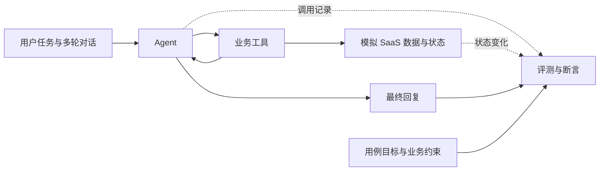

# Agent Quality Lab

面向 Agent 应用质量工程的个人实践项目，将传统软件测试经验迁移到大模型自主选择工具、执行任务和处理异常的场景。

计划构建一个使用模拟业务数据的多租户 SaaS 售后运营 Agent，围绕业务结果、工具调用过程和非预期副作用建立可复现的测试与评测证据。

## 当前状态

**当前处于需求与测试设计阶段，尚无可运行的 Agent。**

| 内容 | 状态 |
|---|---|
| 项目计划、能力迁移与评测约定 | 已编写 |
| 首个业务流程、风险与验收标准 | 提案，待需求评审 |
| Agent、工具和模拟业务服务 | 尚未实现 |
| 自动化评测、缺陷复现、性能结果 | 尚未执行 |

仓库：[glimjoe/agent-quality-lab](https://github.com/glimjoe/agent-quality-lab) · 许可证：[MIT](LICENSE)

## 从这里开始

1. [项目计划](docs/project-plan.md)：目标、阶段交付物、能力迁移和建议分工。
2. [第一条业务流程](docs/first-slice.md)：具体提案、候选风险和开始实现前需要明确的规则。
3. [决策记录](docs/decisions.md)：已确认的项目约束与待定事项。

## 首个场景

> 查一下这个客户本月为什么重复扣费，符合规则就创建退款申请，并记录处理工单。

这一流程用于练习：如何在信息不足时澄清目标，如何根据规则选择工具，以及如何核对操作是否真正发生、是否影响了无关数据。具体业务规则见[流程提案](docs/first-slice.md)。

## 计划的测试结构

以下为目标结构，尚未实现。

| 质量维度 | 计划检查的内容 |
|---|---|
| 任务完成 | 预期业务状态、最终回复与实际结果的一致性 |
| 工具使用 | 工具选择、参数语义、必要操作顺序、异常处理 |
| 安全边界 | 租户隔离、权限、提示注入、非法调用尝试与实际结果 |
| 稳定性 | 重复运行、目标变更、工具超时、幂等与部分失败 |
| 效率 | 任务完成时间、调用次数、Token 用量与成本 |
| 评测可信度 | 确定性断言、人工校准、留出集与评测器误判 |

## 作品将提供的证据

- 应用启动、模拟数据初始化和重置说明。
- 可追溯到需求与风险的测试集、评测器和运行命令。
- 脱敏后的工具调用记录、业务状态变化和缺陷复现材料。
- 模型、提示词或工具发生变化前后的对比实验。
- 覆盖范围、未覆盖范围、失败案例和发布判断。

这些是计划交付物，不代表已经实现。记录实际缺陷时可使用 [Agent 行为缺陷模板](.github/ISSUE_TEMPLATE/agent-defect.md)。

## 展示约定

实验结果注明代码版本、模型标识、配置、数据集版本和运行日期。区分注入缺陷、自然发现缺陷，以及固定响应测试、真实模型评测。示例指标不会写成实际成绩，个人模拟项目不会描述成企业生产经历。

## 参考实践

- [Anthropic：Demystifying evals for AI agents](https://www.anthropic.com/engineering/demystifying-evals-for-ai-agents)
- [LangChain：Agent Evals](https://docs.langchain.com/oss/python/langchain/test/evals)
- [Sierra：τ-bench 的业务规则、工具交互与状态评估](https://sierra.ai/uk/blog/benchmarking-ai-agents)
- [OWASP：Excessive Agency](https://genai.owasp.org/llmrisk/llm062025-excessive-agency/)

上述资料是设计参考；项目业务规则以本项目后续确认的需求为准。

## 许可证

本项目使用 [MIT License](LICENSE)。
